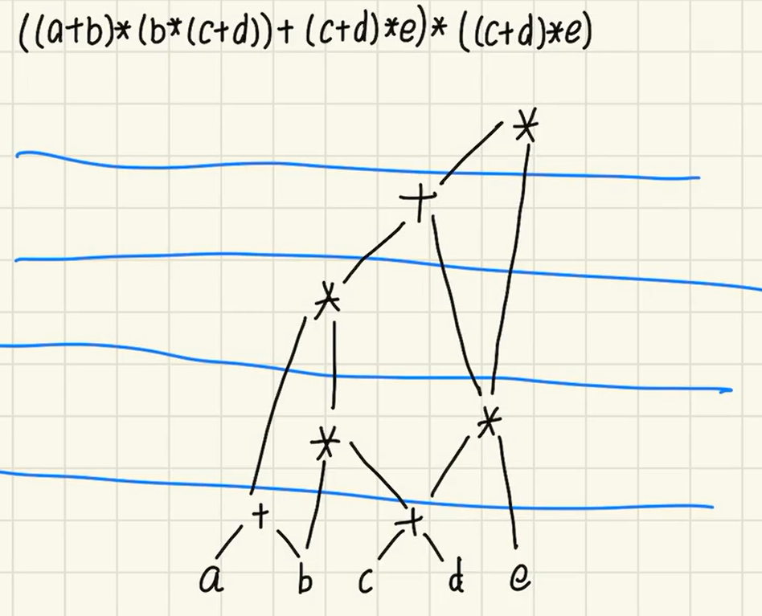

## 十字链表法
**十字链表构建逻辑总结与规范范式**
十字链表的本质是“一节点两链穿”**：对全图的每一条有向边 $\langle u, v \rangle$，仅动态分配**一个**弧结点，通过**头插法同时接入起点 $u$ 的出边链表与终点 $v$ 的入边链表。
**一、核心构建三步法（原子操作）**
对于任何一条确定的有向边 $\langle u, v \rangle$（无论源自邻接矩阵扫描还是三元组输入），均执行以下标准操作：
1. **申请与登记**：
* 分配 1 个边结点空间 `ArcNode *p`。
* 登记顶点编号：`p->tailvex = u`（起点），`p->headvex = v`（终点）。
2. **挂载出边链（同弧尾，横向穿接）**：
* 将该结点头插到起点 $u$ 的出边表头：
```c
p->tlink = G.xlist[u].firstout;
G.xlist[u].firstout = p;
```
3. **挂载入边链（同弧头，纵向穿接）**：
* 将该结点头插到终点 $v$ 的入边表头：
```c
p->hlink = G.xlist[v].firstin;
G.xlist[v].firstin = p;
```
---
**二、两种输入场景的处理框架**
* **场景 A：输入为三元组序列 $(u, v, w)$（最推荐，直接输入边集）**
* **逻辑**：单层循环遍历所有边，直接对每条边执行上述“三步法”。
* **复杂度**：时间复杂度为 $O(\vert{}V\vert{} + \vert{}E\vert{})$，无冗余扫描。
* **场景 B：输入为邻接矩阵 `Matrix[n][n]**`
* **逻辑**：双层嵌套循环扫描每一个单元格；当且仅当检测到有效边（`Matrix[i][j] != 0 && Matrix[i][j] != INF`）时，令 $u=i, v=j$ 触发执行“三步法”。
* **复杂度**：受矩阵规模约束，时间复杂度为 $O(\vert{}V\vert{}^2)$。
---
**三、设计精要与解题答题技巧**
* **时空双优**：采用头插法插入单条边的开销恒为 $O(1)$，免去了尾插法需要遍历链表找末尾的缺陷；整张图只需要 $\vert{}E\vert{}$ 个弧结点，空间利用率为链式最优。
* **口诀记忆**：
* **tlink 随 tail**：串联同起点（弧尾）的出边，起点指针是 `firstout`。
* **hlink 随 head**：串联同终点（弧头）的入边，终点指针是 `firstin`。
## 多重链表法
* **顶点节点**：确实更简单了，只需 **1 个数据值 + 1 个边指针**（`firstedge`），用来指向依附于该顶点的第一条边。
* **边节点**：包含 **2 个指针**，但它们不是入边/出边指针，而是：
* **`ilink`**：指向依附于**端点 $i$** 的下一条边。
* **`jlink`**：指向依附于**端点 $j$** 的下一条边。
---
**遍历时的细节（与十字链表最大的不同）**
十字链表因为方向固定，找出边无脑走 `tlink`，找入边无脑走 `hlink` 即可。
但在邻接多重表中，一条边没有方向，遍历时需要**根据当前是哪个顶点做一次 `if` 判断**：
* 假设我们要遍历**顶点 $k$** 连出的所有边：
* 拿到一条边节点 `p`。
* 如果 `p->ivex == k`，那么下一条依附于 $k$ 的边就顺着 **`p->ilink`** 找。
* 如果 `p->jvex == k`，那么下一条依附于 $k$ 的边就顺着 **`p->jlink`** 找。
## AOE和AOV图
### **AOE 关键路径四步法速记**
> ---
> **一、四个核心概念**
> * **点的最早发生时间 $ve[k]$（事件）**：所有前驱任务全部完工的最早时刻。
> * **点的最迟发生时间 $vl[k]$（事件）**：在不推迟总工期的前提下，该事件最晚必须完成的时刻。
> * **边的最早开始时间 $e[i]$（活动）**：直接取决于**起点事件的最早发生时间**，前置条件一旦就绪即可开工。
> * **边的最迟开始时间 $l[i]$（活动）**：必须用**终点事件的最迟允许发生时间**，减去**该任务本身的耗时**，为保证终点不超期而倒扣出的最晚开工死线。
> ---
> **二、标准求解步骤**
> * **第一步：顺推求 $ve$（正向拓扑排序，取最大值 $\max$）**
> * 起点赋初值：$ve[\text{起点}] = 0$
> * 状态转移：$ve[v] = \max_{(u, v)} \{ ve[u] + \text{weight}(u, v) \}$
> * 结论：$ve[\text{终点}]$ 即为全工程的**最短总工期**。
> * **第二步：逆推求 $vl$（逆拓扑排序，取最小值 $\min$）**
> * 终点赋初值：$vl[\text{终点}] = ve[\text{终点}]$
> * 状态转移：$vl[u] = \min_{(u, v)} \{ vl[v] - \text{weight}(u, v) \}$
> * **第三步：求各条活动边（任务）的 $e$ 与 $l$**
>   对于任意一条从起点 $u$ 指向终点 $v$、耗时为 $w$ 的活动边：
> * **$e = ve[u]$**（活动最早开始 = 入度的点的最早开始时间）
> * **$l = vl[v] - w$**（活动最迟开始 = 出度的点的最晚开始时间 - 本身任务耗时）
> * **第四步：锁定关键路径**
> * 计算时间差：$l - e$ 即为该活动的**时间缓冲余量**。
> * 筛选关键活动：满足 **$e == l$**（缓冲为 0，不能耽误一分一秒）的边即为**关键活动**。
> * 连线成径：将关键活动**首尾相连**构成的完整通路，即为**关键路径**。
> ---
## 连通，完全的意思
#### 完全：任意两点之间都有边连接（边数拉满）
#### 连通：点与点之间有路径可达（路是通的）

| 类型      | 状态属性 | 最少边数（极小连通）  | 最多边数（完全图）                |
| ------- | ---- | ----------- | ------------------------ |
| **无向图** | 连通   | **$n - 1$** | **$\frac{n(n - 1)}{2}$** |
| **有向图** | 连通   | **$n$**     | **$n(n - 1)$**           |
## 用有向无环图来表示表达式
1.他的构建形式是从下向上
2.第一步首先所有运算字母写在最底层
3.第二部，首先写出最基础的运算符号组合写在倒数第二层，同一个子式就可以只写一次
3.第三步，一层层向上写，知道将表达式表达出来
参考例子



## 阿萨德