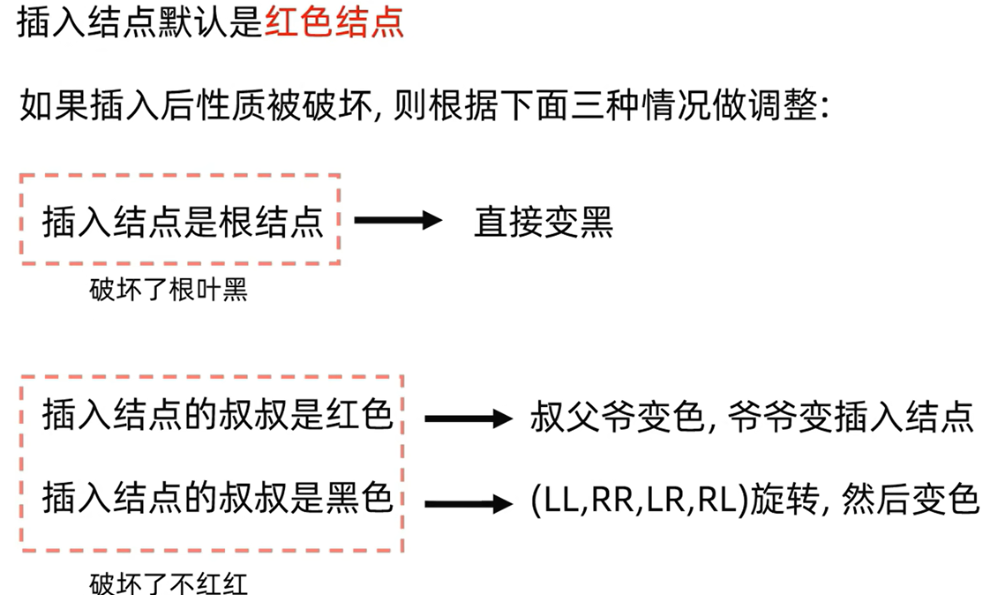
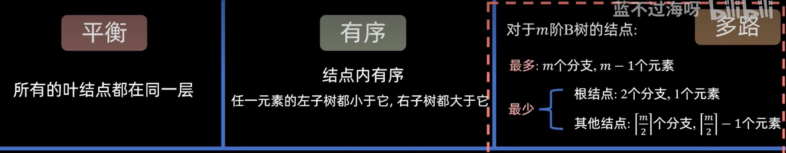
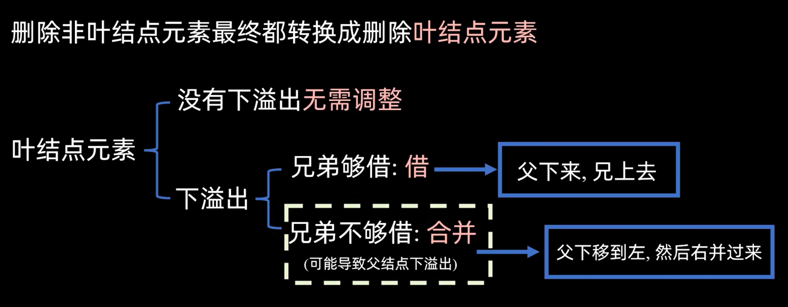
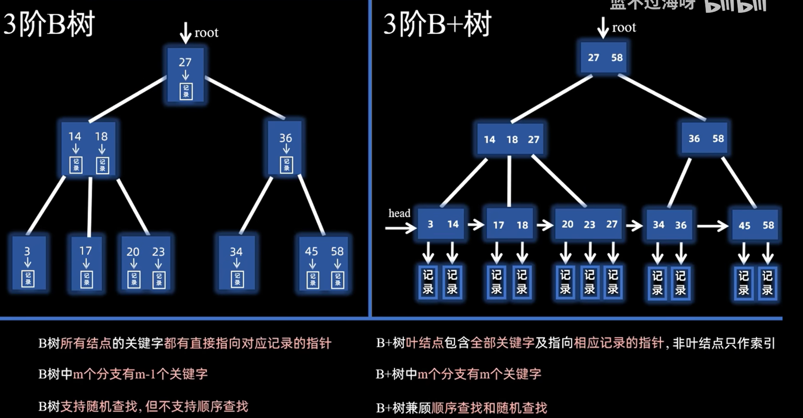

## 红黑树
### 定义：
左根右：二叉搜索树（左<根<右）
根叶黑：根和叶子（NULL）都是黑色
不红红：不存在连续的两个红色结点
黑路同：任一结点到叶所有路径黑结点数量相同

高度：最长路径不超过最短路径的两倍，任一结点左右子树的高度相差不超过两倍
### 插入：

## b树

三个特点：

删除操作：

### 构建：
就是一堆点，一个个插入，然后一直向上形成根，新的根的过程
### 插入：

## b+树
他主要用于数据库的查询，只有叶子节点是用来指向索引的，别的节点都是指向索引的索引，
具体看 辨析内容
## b树 b+树辨析

## 查找失败的平均查找长度
### 一、 核心计算公式
$$\text{ASL}_{\text{fail}} = \frac{\sum_{i=0}^{p-1} \text{从入口 } i \text{ 出发找到第一个空位置的比较次数}}{p}$$
* **分子**：从每一个**可能的哈希映射入口**出发，按照冲突处理方法（如线性探测）依次向后检查，直到遇到**第一个空位置**止，所比较的次数之和。
* **分母 $p$**：**哈希函数的模数**（即可能产生的哈希入口地址总数，如 $H(\text{key}) = \text{key} \pmod p$ 中的 $p$）。
---
### 二、 标准求解三步法
以**线性探测法**（如 $H(\text{key}) = \text{key} \pmod p$）为例：
#### 第一步：模拟建表
1. 依据哈希函数 $H(\text{key})$ 计算每个关键字的初始位置。
2. 若发生冲突，按线性探测规则依次向后寻找空位，将所有给定的关键字填入哈希表中。
#### 第二步：计算各入口的比较次数
1. 确定所有**可能的入口地址**（即 $0 \sim p-1$，共 $p$ 个起点）。
2. 从起点 $i$ 开始向后数，检查经过了多少个非空结点，直到撞见第一个“空”停止。
3. **记步规则**：起点算第 1 次，每往后移一位加 1 次，直到踩到空位置（空位置本身也算作最后一次比较）。
#### 第三步：求平均值
1. 将 $0 \sim p-1$ 这 $p$ 个起点算出的比较次数全部相加。
2. **除以 $p$**（注意：分母永远是哈希函数的**模数 $p$**，而不是哈希表的总长度 $m$，更不是表中的空位数）。
---
### 三、 避坑要点（易错点）
1. **分母是模数 $p$，不是表长 $m$**：
* 即使哈希表长度为 11，如果哈希函数是 $\text{key} \pmod 7$，任意未知 key 算出的初始落脚点只能是 $0 \sim 6$，所以**分母固定为 7**。
2. **遇空即停**：
* 查找失败的本质是“证明该数不存在”。只要看到**空位置**，就说明该数不可能存在于表中，查找立即终止。
3. **循环回绕（注意边界）**：
* 若向后探测到哈希表末尾仍未遇到空位置，探针会**循环绕回下标 0** 继续向后查找，直到撞见空位。

### 通俗化表达：
1.首先给题目给的数字按照罗卜填坑写进去
2.然后从每一个入口出发，计算每一个入口到第一个空位需要的长度，然后累加除以mod长

## 查找成功的平均查找长度
1.首先给题目给的数字都填进去
2.然后就按照题目给的算法找，第一个计算找到了就是1次，如果往后n次找到了就是n+1次