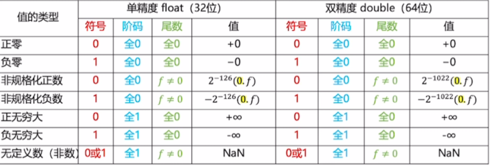

# 数据表示与运算 · 总文件

## 一、真值、原码、反码、补码、移码（八位为例）

以八位为例，最高位为符号位，移码偏移量为 63，表示范围是 -128 到 127。

**正数示例（真值 +0000 1010）**

| 码制 | 表示 |
|---|---|
| 真值 | 0000 1010 |
| 原码 | 0000 1010 |
| 反码 | 0000 1010 |
| 补码 | 0000 1010 |
| 移码 | 0100 1001 |

**负数示例（真值 -0000 1010）**

| 码制 | 表示 |
|---|---|
| 真值 | 0000 1010 |
| 原码 | 1000 1010 |
| 反码 | 1111 0101 |
| 补码 | 1111 0110 |
| 移码 | 0011 0101 |

**要点归纳**

- 正数：原码、反码、补码三者相同。
- 负数：三者都不同。反码等于原码除符号位外按位取反；补码等于反码加一。
- 零的问题：原码、反码的零不唯一（有 +0 与 -0），补码的零唯一。

## 二、任意一个数转为浮点数表示

以 52.5 为例：

- 先转成二进制：52.5 = 110100.1
- 再规格化为：1.101001 × 2的五次方
- 其中，前面的部分用尾数存储，后面的部分用阶码存储。

## 三、浮点数加减运算的步骤

1.先按标准形式写出参与运算的每个数。注意，原阶码用补码表示时范围是 -127 到 126，加上 127 之后就没有符号位了，范围变成 1 到 254。

2.看哪个数的指数大，把指数小的那个数向大的对齐，右移相差的位数。

3.看是加法还是减法，都直接给符号位和省略的隐含 1 带上，例如写成 11.1 或 01.11。

- 加法：直接相加。
- 减法：如果最后出现 +-+ 或 -++ 的形式，就直接用绝对值大的减绝对值小的，符号跟着绝对值大的那个数走。用原码计算，不要用补码，算完之后再化为规范形式。
- 总之，无论谁加谁，都不要带符号位去算。同号相加就记住符号直接加；异号就用上面绝对值相减的办法。带符号位运算会出问题。

## 四、浮点数的舍入与上下溢

**舍入规则**
有三个冗余位。如果大于 100 就进一，小于就舍去；只有正好等于 100 的时候，才根据尾数的情况决定进位还是舍去——尾数为1则进位，尾数为0则舍去。

**上溢**
两个数相加，如果算出的结果在尾数和阶码规格化的过程中阶码全为1，那就直接舍弃尾数，表示为无穷大。

**下溢**
两个数相减，也是在尾数和阶码规格化的时候，当尾数左规、阶码变成 00000001 时，直接把阶码变为全零，尾数不再移位，相当于损失一点精度。保持原样后，例如尾数是 000101，那就是 1.01 乘以 2 的负三次方，再乘以 2 的负126次方。

## 五、逻辑移位与算术移位对比

| 类型 | 左移 | 右移 |
|---|---|---|
| 逻辑移位 | 高位移出，低位补 0 | 低位移出，高位补 0 |
| 算术移位 | 高位移出，低位补 0 | 低位移出，高位补符号位 |

补码移位默认是算术移位。


## 知道一个负数的原码，快速的化为补码
like 1011 =-3
A为原码除符号位的数值
位数为储存位数 4 or 8
$\text{补码=}2^{\text{位数}}-|A|$
得到的答案按照无符号数展开
$2^{4}-3=13$=1101(补码)
### 知道一个负数的补码快速求他的值
### 零少的情况：
like 1101 （-3的补码）

$$X = -\left( 1 + \sum_{i \in S} 2^i \right)$$

> **其中：**
> - $X$ 为要求得的十进制真值。
> - $i$ 代表数值位的索引（从低位到高位依次为 $0, 1, 2 \cdots$）。
> - $S$ 是**所有数值位中代码为 `0` 的位数集合**。

### 一少的情况：
like 1101 
$2^{位数}-看作无符号数=真值的数值部分$
16-1101（13）=3
1101的原码为1011

## 类型转换和截断增长变化
整形数据的类型转换
1.位截断：
长类型变为短类型，直接舍弃高位，保留低位部分
2.位扩展：
填充高位保证语义不变
1）零扩展：用于无符号数，高位补零
2）符号扩展 ：用于有符号数，高位填充符号位
3.有符号数和无符号数的转换：
不改变实际的二进制位数，只改变解释方式
当两种情况同时发生：先类型转换在有无符号数

## 四种符号位：
#### 零标志ZF（zero flag），
结果为零，ZF为1，对有无符号数均有意义
#### 溢出标志OF（over flag)，
用于判断有符号数是否发生溢出，溢出为1
OF=$C_{n}\oplus C_{n-1}$(符号位进位和最高位进位的异或)
对应的四种情况，

| Cn（符号位进位） | Cn-1（数值最高位进位） | OF（异或结果） | 是否溢出    |
| --------- | ------------- | -------- | ------- |
| 0         | 0             | 0        | 正数相加无溢出 |
| 0         | 1             | 1        | 正数相加溢出了 |
| 1         | 0             | 1        | 负数相加溢出了 |
| 1         | 1             | 0        | 负数相加无溢出 |
#### 符号标志SF（sign flag）
等于结果F的最高位（符号位），仅对有符号数有意义，SF为1，负号；SF为0，正号
#### 进/错位标志CF（carry flag）
用于表示无符号数运算中的进位/错位情况，判断是否溢出，仅对无符号数有意义
CF=$Sub\oplus C_{out}$,CF为1即溢出（sub为减法控制信号，加法为0 减法为1，$C_{out}$为
最高位进位输出信号，进位为1）

|Sub (加 / 减)|Cout​ (实际外抛进位)|硬件发生的实际情况|CF 结果|最终结论|
|---|---|---|---|---|
|0 (加法)|0|加法正常进行，最左边没有冒出进位。|0⊕0=0|无进位（安全）|
|0 (加法)|1|加法结果太大，往外爆出了一个进位。|0⊕1=1|💥 加法溢出 (有进位)|
|1 (减法)|0|减法不够减（小减大），硬件加法没能憋出进位。|1⊕0=1|💥 减法溢出 (有借位)|
|1 (减法)|1|减法够减（大减小），硬件加法强力顶出了一个进位。|1⊕1=0|无借位（安全）|
第三个：计算减法就是A-B=A+$\bar{B}+1$,然后复杂计算，如果是小减大，一定会变为进位的补码相加


##  无符号减法原理

计算机的寄存器和加法器也是有位数限制的。比如一个 **4位的二进制系统**，它能表示的最大无符号数是 `1111`（十进制 15）。如果再加 1，就会变成 `10000`（十进制 16）。
但因为硬件只有 4 位，最高位的 `1` 直接被丢弃（溢出截断）了，结果重新变成了 `0000`。
这就意味着，4位系统的**模是 $16$（即 $2^4$）**。它就像一个只有 16 个刻度的表盘，转满一圈就清零。
如果你想算 $9 - 5$，在模 16 的系统里，等价于算：
$$9 + (16 - 5) = 9 + 11 = 20$$
而 20 超过了 16，溢出截断后就是 $20 - 16 = 4$。
所以，**减去 5**，物理效果完全等价于**加上 11**！
### 3. “按位取反加1” 是怎么把 11 变出来的？
既然减去 $B$ 等价于加上 $16 - B$，那计算机怎么计算 $16 - B$ 呢？如果为了算 $16 - B$ 又去画个减法电路，那就本末倒置了。
天才的设计就在这里：**在二进制中，“$16 - B$” 可以通过极低成本的“按位取反，末位加 1”直接得到！**
我们把 $16 - B$ 拆解一下：
$$16 - B = (15 - B) + 1$$
- **第一步：求 $15 - B$**
- 
在 4 位二进制里，$15$ 的二进制是 `1111`。用 `1111` 减去任何一个 4 位二进制数，会发生什么？
假设 $B = 5$（`0101`）：
Plaintext
```
1111  (15)
- 0101  (5)
--------
1010  (10)
```
你发现了吗？用 `1111` 去减，**结果刚好就是把 `0101` 的每一位都反过来（0变1，1变0）**！
所以，**“按位取反”在数学上极度快捷地实现了 $15 - B$**。而对电路来说，按位取反只需要加一排简单的非门（NOT Gate）即可，不需要任何减法器。

- **第二步：再加 1**
刚才我们拆解的公式是 $(15 - B) + 1$。
我们把按位取反得到的 `1010`（也就是 10）在末位**加上 1**，就得到了 `1011`（也就是 11）。
瞧！**$16 - 5$ 的值（11），通过“取反（得到15-5）再加1”完美诞生了。**
### 总结
当你让计算机做无符号减法 $A - B$ 时：
1. 计算机把 $B$ **按位取反**，得到了 $15 - B$ 的二进制。
2. 计算机在末位**加 1**，把结果变成了 $16 - B$（即 $B$ 的补数）。
3. 计算机把 $A$ 和这个补数**相加**。
4. 依靠硬件的**自然溢出截断**（自动减去 16），最终得到的数字刚好就是 $A - B$ 的正确答案。
这就利用了二进制本身的数学特性，把减法完美伪装成了加法！

## 逻辑移位，算数移位
逻辑移位，算数移位：
逻辑移位：
左移高位移出，低位补0
右移低位移出，高位补0
算数移位：
左移：高位移出，低位补0.
右移：低位移出，高位补符号位
## 小端方式和边界对齐
* - 为你梳理这两个在考研计组中极易混淆且高频出题的存储机制：**小端方式（Little-Endian）与边界对齐（Boundary Alignment）**。
### 一、 小端方式 (Little-Endian)
小端方式规定了多字节数据（如 16 位、32 位整数）在**连续内存字节单元中的存放顺序**。
#### 1. 核心口诀
> **“小端小地址”**（即：数据的**低位字节（LSB）存放在内存的低地址**中，数据的高位字节存放在高地址中）。
#### 2. 直观示意
假设有一个 32 位十六进制数 `12 34 56 78H`，其字节高低位为：
- 最高有效字节 (MSB)：`12H`
- 最低有效字节 (LSB)：`78H`
​
将其存入从地址 `0x1000` 开始的内存中，小端与大端的存放对比：

| **内存地址**       | **小端方式（Little-Endian）** | **大端方式（Big-Endian）** |
| ------------------ | ----------------------------- | -------------------------- |
| `0x1000`（低地址） | **78H** (LSB)                 | `12H` (MSB)                |
| `0x1001`           | **56H**                       | `34H`                      |
| `0x1002`           | **34H**                       | `56H`                      |
| `0x1003`（高地址） | **12H** (MSB)                 | `78H` (LSB)                |
#### 3. 典型考点与特点
- **指针类型转换（如 C 语言强制类型转换）**：在小端机器上，将 `int*` 转为 `char*`，取到的第一个字节正好是该整数的最低字节（LSB），符合逻辑直觉。
​
- **常用架构**：x86 / x64、RISC-V 默认采用小端方式。
​
### 二、 边界对齐 (Boundary Alignment)
边界对齐是计算机在内存中安排变量地址的一种**空间换时间策略**。
#### 1. 核心原因（为什么要对齐？）
现代 CPU 的数据总线宽度通常为 32 位（4 字节）或 64 位（8 字节），内存控制器**每次访存都是按字（Word）或双字边界对齐读取**的。
- **不采用边界对齐**：一个 4 字节的 `int` 变量如果跨越了两个 4 字节的存储字边界，CPU 就必须**访存 2 次**，并在内部进行拼接，严重降低效率。
​
- **采用边界对齐**：通过在变量之间填充空白字节（Padding），确保任何变量都能在 **1 次访存**内完整取出。
​
#### 2. 对齐规则
1. **数据项自身的对齐规则**：
- 1 字节数据（如 `char`）：可以存放在**任意地址**。
- 2 字节数据（如 `short`）：起始地址必须是 **2 的倍数**（低 1 位二进制为 `0`）。
- 4 字节数据（如 `int`, `float`, 指针）：起始地址必须是 **4 的倍数**（低 2 位二进制为 `00`）。
- 8 字节数据（如 `long long`, `double`）：起始地址必须是 **8 的倍数**（低 3 位二进制为 `000`）。
​
1. **结构体（Struct）整体的对齐规则**：
- 结构体的**总大小**必须是其内部**最大成员对齐字节数的整数倍**（不足的在尾部补齐）。
### 三、 两者对比与速记表
| **知识点**   | **解决什么问题？**                                  | **核心原则**                         | **考研高频陷阱**                                             |
| ------------ | --------------------------------------------------- | ------------------------------------ | ------------------------------------------------------------ |
| **小端方式** | 一个多字节数据**内部各个字节**在内存中的排列顺序    | **低位存低地址，高位存高地址**       | 加法计算/扩展时注意哪个是 LSB；画内存示意图时别把高低地址写颠倒。 |
| **边界对齐** | 多个变量/结构体在内存中的**起始地址选择**与空间填充 | **数据起始地址是其类型大小的整数倍** | 结构体大小补齐时，容易漏掉尾部（Trailing Padding）的填充字节。 |
## 浮点数范围表格
