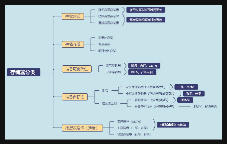
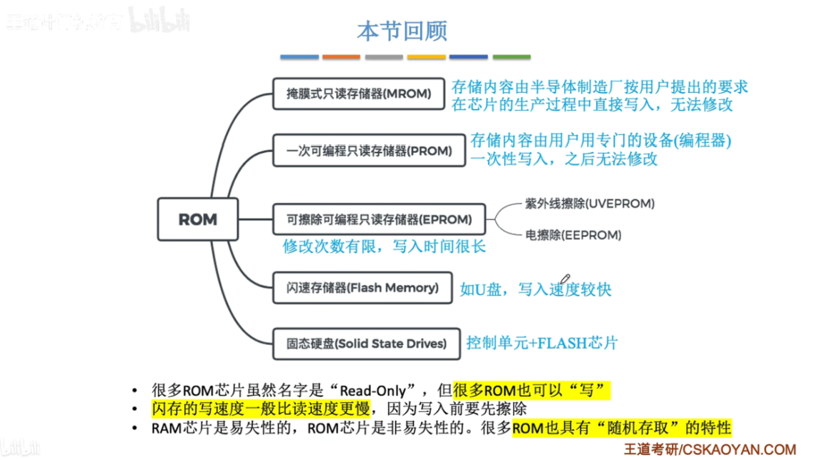
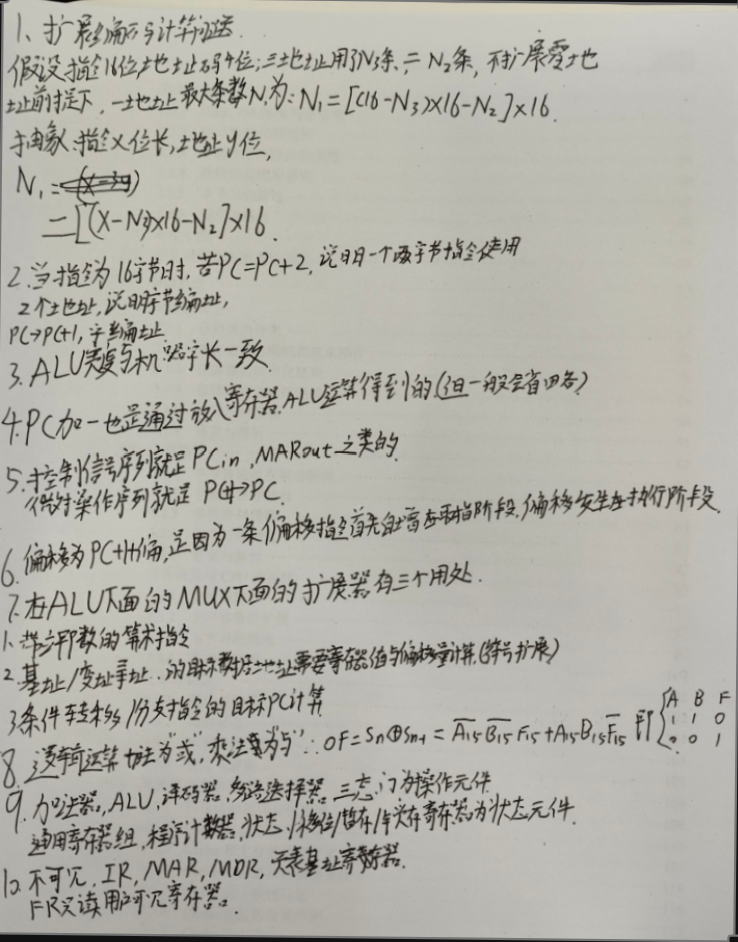
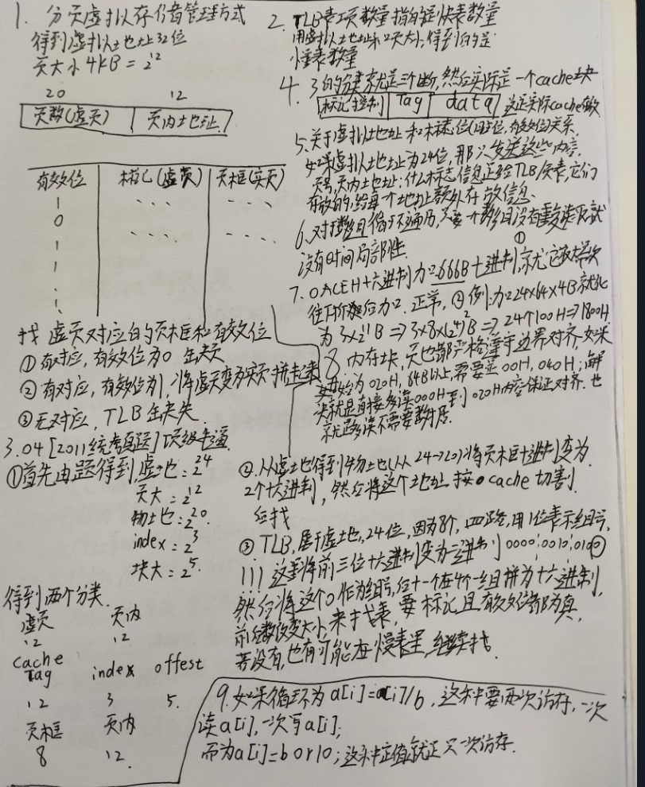

# 存储器 · 总文件

## 一、位、字节、字

**位（bit）——物理最小单位**
0 或 1。在存储矩阵里，一个 cell 通常存 1 bit，可以理解成一块砖。

**字节（Byte）——基本编址单位**
规定 1 Byte = 8 bit。现代主流计算机（如 Intel、AMD 的 PC）通常按字节编址，也就是地址加一就多 1 Byte。

**字（Word）——CPU 最自然处理的单位**
更准确的说法是：字是 CPU 一次最自然、最高效处理的数据单位，而不是「最小」单位。因为 CPU 也能处理 8 bit、16 bit、32 bit，只是对于 64 位 CPU，最自然的是 64 bit，这叫 1 字。

**字和数据线有关**
因为一次搬多少数据，取决于通路宽度。比如 CPU 数据总线有 64 根，一次并行传 64 bit，就很适合 64 位字长。

**总线宽度影响体系结构**
- CPU 决定：字长（32位/64位）、寄存器宽度、ALU 宽度。
- 主板/总线决定：一次能传多少 bit，例如 64 bit 内存总线。
- 内存：内部矩阵很大，但通过 IO 输出固定宽度，例如 DDR 常见 x8、x16，多个芯片并联成 64 bit 总线。
- 地址总线如果 32 根，寻址空间就是 2的32次方 = 4 GB。

**最终模型**
```
位(bit) → 最小物理单位，0/1
8个位 → 1字节(Byte)，存储基本单位
若干字节组成 → 1字(Word)，CPU最自然处理单位（32位机=4Byte，64位机=8Byte）
数据线宽度 → 决定一次搬多少 bit → 影响系统性能
```

一句话总结：bit 是砖块，Byte 是小盒子，Word 是 CPU 一次最顺手搬的一箱货，数据线决定这箱货一次怎么搬。

## 二、存储器按访问方式分类

| 类型 | 特点 | 访问时间与地址的关系 | 典型设备 |
|---|---|---|---|
| 随机存取 Random Access | 可以直接访问任意地址，速度稳定 | 访问 A 地址 ≈ 访问 B 地址 | SRAM、DRAM、ROM、PROM、EPROM、EEPROM |
| 直接存取 Direct Access | 可以直接定位到目标块，不需按顺序经过前面的数据，但访问时间与位置有关 | 访问 A 地址 ≠ 访问 B 地址（延迟不同） | SSD、Flash、HDD、光盘（CD/DVD） |
| 顺序存取 Sequential Access | 必须顺序访问，想访问后面的内容要先经过前面的内容 | 访问时间强烈依赖位置 | 磁带、录像带、老式串行纸带存储 |

例子说明：
- 随机存取：CPU 访问地址 100 和地址 100000，时间基本相同。
- 直接存取：机械硬盘读扇区 100 和扇区 100000 都能直接到达，但寻道时间不同。
- 顺序存取：想读第 1000 段数据，必须从 1 到 2 到 3 一直到 1000，不能直接跳过去。

## 三、64×64×8 存储矩阵

**存储矩阵结构**
一个 64×64×8 的存储矩阵，可以这样理解：有 8 个平面（Plane），每个平面是一个 64×64 的二维矩阵，矩阵中的一个存储单元（Cell）只能存 1 个 bit。

示意（每个「□」就是一个存储元）：

```
Plane0： □□□□□□□...
Plane1： □□□□□□□...
...
Plane7： □□□□□□□...
```

**每个平面有多少存储元**
每个平面：64 × 64 = 4096 个存储元。
每个存储元大小：1 bit。
所以一个平面的容量：4096 bit。

**整个存储矩阵的容量**
因为共有 8 个平面：64 × 64 × 8。
总存储元数量：32768。
总容量：32768 bit。
换算成字节：32768 ÷ 8 = 4096 Byte，也就是 4 KB。

**字节的组成**
对于同一个坐标，例如（第10行，第20列），在 8 个平面上都有一个对应的 bit：

```
Plane0 → 0
Plane1 → 1
Plane2 → 1
Plane3 → 0
Plane4 → 1
Plane5 → 0
Plane6 → 0
Plane7 → 1
合起来：01101001，即 8 bit = 1 Byte
```

所以可以理解为：同一坐标下，8 个平面上的 8 个 bit 共同组成 1 个字节。

**按行写入与数据线数量**
如果选择某一行（例如第3行），那么这一行在每个平面中都有 64 bit。因为共有 8 个平面，总写入量是 64 × 8 = 512 bit，换算即 64 Byte。

一根数据线一次只能传输 1 bit，所以如果整行并行写入，需要 64 × 8 = 512 根数据线。原因在于每列需要 8 bit（对应 8 个平面）：第1列 8 bit、第2列 8 bit……第64列 8 bit，共 64列 × 8 bit = 512 bit，因此需要 512 条数据线同时传输。

**一句话概括**
1 个 Cell = 1 bit；8 个 Plane 同一坐标 = 1 Byte；一行 64 个坐标 = 64 Byte；整行并行写入需要 512 根数据线。

## 四、MAR、MDR、CPU、主板、系统位数

### 基础定义

| 寄存器 | 存放内容 | 位数 | 功能 |
|---|---|---|---|
| MAR 存储器地址寄存器 | 内存单元地址 | 等于地址总线位数 | 指明要访问内存的哪个单元，只管地址不管数据 |
| MDR 存储器数据寄存器 | CPU 与主存之间读写的二进制数据 | 等于数据总线位数，也等于存储字长 | 作为 CPU 与主存之间的数据中转缓冲，只管数据不管地址 |

### 各自位数由谁决定

**MAR 位数**
- 决定因素：地址线数量或系统寻址模式。
- 核心作用：决定最大寻址内存空间。
- 编址规则：计算机默认按字节编址，1 个地址 = 1 Byte。
- 公式：n 位 MAR → 寻址空间 = 2的n次方 B。例如 32 位 MAR → 2的32次方 B = 4 GB。

**MDR 位数**
- 决定因素：CPU 字长、主板数据总线位宽、内存字长。
- 核心作用：决定总线一次传输的数据位数。
- 它不影响寻址范围，只影响传输带宽和吞吐效率。

### CPU、主板、内存的三层关系

**CPU**
- 决定机器字长和内部寄存器位宽。
- 决定 MDR 的设计位宽。
- 有 32 位与 64 位两种工作模式。

**主板**
- 板载地址总线、数据总线，是 CPU 与主存之间的传输通路。
- 总线位宽固定；如果 CPU 与内存位宽不匹配，主板负责数据的拆分与拼接，实现兼容传输。

**内存**
- 永远按字节编址（1 地址 = 1 B，最小编址单元不变）。
- 单次读写的块大小，对齐数据总线或 MDR 位宽。

### 系统位数（x86 32位 / x64 64位）

系统位数不改动硬件线路，而是锁定 CPU 的工作模式，同时约束地址通路与数据通路。

**32 位系统（x86）**
- CPU 强制进入 32 位保护模式。
- 只使用低 32 位地址，MAR 等效 32 位，寻址上限锁死在 4 GB。
- MDR、数据总线、通用寄存器都被限制为 32 位运行。
- 64 位硬件被软件阉割高位，无法发挥完整性能。

**64 位系统（x64）**
- CPU 工作在 64 位长模式。
- 完整启用 64 位地址线、数据线。
- MAR、MDR、总线、寄存器全部跑满硬件规格。
- 寻址空间极大，支持大内存、高带宽吞吐。

### 核心逻辑归纳

1. MAR + 地址总线：管「能寻址多大内存」，受系统位数的寻址模式约束。
2. MDR + 数据总线：管「一次能传多少数据」，由 CPU、主板、内存的位宽决定。
3. 系统位数：在软件层面锁定 CPU 模式，同时限制地址宽度和数据传输位宽。
4. 当下 Intel、AMD、DDR4、DDR5 以及主板总线已全员统一到 64 位标准，无需手动匹配位宽；32 位只用于老旧设备和软件兼容。

## 五、多体并行存储器与单体多字存储器

**多体并行存储器**
- 高位交叉：没有实现并行。数据仍然是一块填满之后，再填下一块。
- 低位交叉：实现了并行。四个数据分别存放在四块中，利用了电容充电的时间。

**单体多字存储器**
一个存储单元存放多个字。虽然我只需要一个字，但它会一次性拿出很多字放入缓冲区。它利用了程序的局部性原理，但是灵活性较差。

## 六、字扩展，位扩展

#### 一、位扩展（解决“数据线不够宽”）
- **核心矛盾**：CPU 数据线位数 > 内存芯片数据位数（例如：CPU 是 8 位，芯片只有 4 位）。
- **连接方式**：
- **地址线**：所有芯片**并行并联**（接收相同的地址 signal）。
- **数据线**：各芯片**分工合作**，分别连接 CPU 数据线的不同位置（如：芯片 1 负责 $D_0 \sim D_3$，芯片 2 负责 $D_4 \sim D_7$）。
- **片选信号（CS）**：所有芯片接同一个片选信号，**同时工作**。
- **物理本质**：合体之后在逻辑上相当于**一块大位宽的芯片**，不可分割。
- **典型实例**：用 8 块 $8\text{K} \times 1\text{b}$ 芯片 $\longrightarrow$ 组成 $8\text{K} \times 8\text{b}$ 的存储器。
#### 二、字扩展（解决“地址线不够长 / 容量不够大”）
- **核心矛盾**：CPU 地址线位数 > 内存芯片地址位数（例如：CPU 16 条地址线可寻址 64K，芯片只有 13 条只能寻址 8K）。
- **连接方式**：
- **低位地址线**：接所有芯片的地址引脚（用于芯片内部寻址）。
- **高位地址线**：用于**片选（选择哪一块芯片工作）**。
- **数据线**：所有芯片的数据线**并行并联**接到 CPU 数据线。
**高位片选的两种实现方式：**
1. **线选法**：
- 用多余的 $n$ 条高位地址线直接连接 $n$ 个芯片的片选端。
- **特点**：电路简单，但只能接 $n$ 个芯片，地址空间不连续，容易浪费地址线。
2. **译码片选法**（常用）：
- 将多余的 $n$ 条高位地址线接入**译码器**，产生 $2^n$ 个输出信号，分别去选 $2^n$ 个芯片。
- **特点**：充分利用地址空间，扩展容量大。
- **译码器命名**：如 3 条高位地址线进、8 条片选线出，称为 **3-8 译码器**（或 $1 \to 2$ 译码器等）。
- **典型实例**：用 8 块 $8\text{K} \times 1\text{b}$ 芯片 $\longrightarrow$ 组成 $64\text{K} \times 1\text{b}$ 的存储器。
### 三、字位同时扩展
在实际考研题中，往往需要同时进行字扩展和位扩展：
1. 先通过**位扩展**凑齐 CPU 的**数据线宽度**（组内芯片合体）。
2. 再通过**字扩展**凑齐 CPU 的**总存储容量**（利用译码器选择不同的组）。
### 四、概念辨析：MAR 与 DRAM 容量关系
- **MAR（地址寄存器）位数**：决定了 CPU 逻辑上**最大可寻址的物理空间**（相当于主板能够支持的最大内存上限）。
- **实际 DRAM 大小**：当前实际插在主板上的物理内存容量（只要 $\le$ MAR 支持的最大空间，都可以正常识别和使用）。


## 带宽计算公式
$$\text{带宽} = \text{工作频率} \times \text{总线宽度（字节）} \times \text{通道数}$$
## 磁盘组成部分
对**磁盘存储器**的组成有明确定义，它由三部分组成：
1. **磁盘控制器**：负责与主机通信、控制数据传输（相当于接口控制电路）。
2. **磁盘驱动器**：这是机械部件的集合体，**内部包含了：磁头、传动机构、主轴电机等**。
3. **盘片**：用来保存数据的物理介质（磁记录介质）。

## 存储器两个关系，容量和价格排序
容量从大到小，速到从快到慢，价格从低到高：
外存（磁带光盘）
辅存（磁盘）
内存
高速缓冲寄存器（Chache）
寄存器

两个关系：
主存-辅存：解决成本和容量的矛盾
cahce—主存：解决主存与cpu速度不匹配的问题

## 存储器总分类思维导图


## MAR，MDR两条线
### 一：
MAR位数等于地址线数量等于主存空间大小，
即MAR有32位，则地址线有32根，主存空间最大能容纳的大小为$2^{32}B==4GB$
### 二：
CPU一次操作的位数（机器字长）=MDR位数=数据线根数
CPU一次操作32位则MDR有32位，则有32根数据线

#### 当是字编址：
机器字长=存储字长=cpu一次操作的位数
这时候主存一个地址的大小不是一字节，是等于cpu一次操作的位数（机器字长）
这时候存储单元大小等于储存字长=字长=机器字长
#### 当是字节编址：
存储字长=机器字长=字长$\neq$存储单元大小
这时候主存通过并联等方式实现一次输出多个存储单元的数据
这时候存储字长等于若干倍存储单元大小

## 各种ROM总结

## 磁盘时间问题
平均读取时间＝巡道时间+旋转延迟时间+传输时间
平均读取时间等于=排队延迟+控制器时间+寻道时间+旋转等待时间（转一圈时间的一半）+数据传输时间
传输时间等于
1.转速/扇区数
2 .扇区数据大小/传输速率
## 磨损均衡概念
每次往一个块写字，会比如写一个页，将这块的别的页全部移出到一个新的，
然后再新的块里对应的页写，然后逻辑地址和物理地址算法改变，让它再次逻辑连续


## Cache 替换算法
### * **随机算法（RAND）**
* 随便选一个主存块替换
* 过于 Freestyle，效果很差
### * **先进先出算法（FIFO）**
* 优先替换最先被调入 Cache 的主存块
* 不遵循局部性原理，效果差
### * **近期最少使用（LRU）**
* 将很久没有被访问过的主存块替换。每个 Cache 行设置一个“计数器”，用于记录多久没被访问
* 基于“局部性原理”，近期被访问过的主存块，在不久的将来也很有可能被再次访问，因此淘汰很久没被访问过的块是合理的。LRU 算法的实际运行效果优秀，Cache 命中率高。
* > **补充标记**：Cache 块的总数 $= 2^n$，则计数器只需 $n$ 位。
### * **最不经常使用（LFU）**
* 将被访问次数最少的主存块替换。每个 Cache 行设置一个“计数器”，用于记录被访问过多少次
* 曾经被经常访问的主存块在未来不一定会用到，LFU 实际运行效果不好


---
## Cache 写策略（Write Policy）
### 一、 写命中 (Write Hit)：要写的数据已经在 Cache 中
1. **全写法 / 写直通法（Write-Through）**
* **操作**：同时写入 **Cache** 和 **主存**。
* **优化**：通常引入 **写缓冲（Write Buffer）**，CPU 把数据写入 Buffer 即可继续运行，由 Buffer 异步慢慢写回主存，避免 CPU 阻塞。
* **特点**：随时保持 Cache 与主存数据一致，但写主存频次高。
2. **写回法（Write-Back）**
* **操作**：**只修改 Cache**，并给该块标记一个 **脏位（Dirty Bit = 1）**。**不立即写主存**，直到该块被替换出 Cache 时才一次性写回主存。
* **特点**：大大减少写主存的次数，效率高，但存在 Cache 与主存短期数据不一致的问题。
---
### 二、 写不命中 (Write Miss)：要写的数据不在 Cache 中
1. **写分配法（Write-Allocate）**
* **操作**：先将主存中的目标块**调入 Cache**，然后在 Cache 中完成修改。
* **搭配原则**：通常与 **写回法（Write-Back）** 组合使用。
* **逻辑**：既然这次把块调进 Cache 了，后面大概率还会写（空间/时间局部性），配合“写回法”后续的写操作就都能在 Cache 中直接命中，效率最高。
2. **非写分配法 / 绕过写（Not-Write-Allocate）**
* **操作**：**直接写入主存**，不把主存块调入 Cache。
* **搭配原则**：通常与 **全写法（Write-Through）** 组合使用。
* **逻辑**：反正全写法本身就要直接写主存，写不命中时直接写主存最省事，没必要专门花时间把整块调入 Cache。
---
### 三、 多级 Cache 架构策略
现代计算机系统结合速度与一致性，通常采用分层混合策略：
* **各级 Cache 之间（如 L1 $\to$ L2）**：采用 **全写法 + 非写分配法**（注重数据一致性，速度极快）。
* **Cache 与 主存之间（如 L3 $\to$ DRAM）**：采用 **写回法 + 写分配法**（大幅减少慢速主存的写次数，提高吞吐量）。
---
### 💡 搭配速记口诀
* **“写回” 必选 “写分配”**（调块进 Cache，留着慢慢改）
* **“直通” 就配 “非分配”**（反正要写内存，干脆不进 Cache）
## cache三种映射方式


# Cache 与主存的三种映射方式

假设主存有 $M$ 个块，Cache 有 $N$ 个块。

---

## 一、 三种映射机制拆解

### 1. 全相联映射（Fully Associative Mapping）

* **规则**：主存中的任意一块可以映射到 Cache 中的**任意一块**。
* **地址结构**：`[ 主存块号 (Tag) ] [ 块内地址 ]`
* **特点**：
* **优点**：Cache 空间利用率最高，块冲突率最低。
* **缺点**：查找速度最慢（每次访问需要将主存块号与 Cache 中所有行进行并发比较），比较器电路极其复杂。

### 2. 直接映射（Direct Mapping）
* **规则**：主存中的每一块只能映射到 Cache 中的**唯一固定行**。
* 映射公式：$\text{Cache 行号} = \text{主存块号} \pmod{\text{Cache 总行数 } N}$
* **地址结构**：`[ 标记 (Tag) ] [ Cache 行号 ] [ 块内地址 ]`
* **特点**：
* **优点**：地址映射和查找极其简单，硬件成本低。
* **缺点**：空间利用率低，块冲突率极高（如果程序频繁访问映射到同一个 Cache 行的不同主存块，会引发严重抖动）。

### 3. 组相联映射（Set Associative Mapping）

* **规则**：将 Cache 分成 $Q$ 个组，每组包含 $k$ 个行（称为 **$k$ 路组相联**）。
* **组间直接映射**：主存块根据公式映射到固定组：$\text{Cache 组号} = \text{主存块号} \pmod{\text{Cache 组数 } Q}$
* **组内全相联**：进入特定组后，可以放入该组内的**任意一行**。

* **地址结构**：`[ 标记 (Tag) ] [ Cache 组号 ] [ 块内地址 ]`
* **特点**：折中了全相联与直接映射的优缺点，是现代计算机 **最常用** 的映射策略。
---

### 二、 三种映射方式硬核对比表

| 对比维度 | 直接映射 | 组相联映射（$k$ 路） | 全相联映射 |
| --- | --- | --- | --- |
| **主存块存放位置** | 只能存入**唯一固定**的 Cache 行 | 存入**固定组**中的**任意行** | 可存入 Cache 的**任意行** |
| ** Cache 冲突率** | 最高 | 居中 | 最低 |
| **空间利用率** | 最低 | 居中 | 最高 |
| **查找/比较器复杂度** | 最低（无需比较或仅比较 1 行） | 居中（同时比较 $k$ 行） | 最高（需同时比较所有 $N$ 行） |
| **替换算法** | 不需要（位置固定，直接覆盖） | 需要（组内多行之间进行替换） | 需要（所有行之间进行替换） |
| **地址映射极端情况** | 组相联在 $k=1$ 时的特例 | — | 组相联在 $k=N$（仅 1 组）时的特例 |

### 三、 考研计算题解题切入点（主存地址划分）

面对地址划分计算题，根据映射方式的不同，主存地址的拆分逻辑如下：

1. **直接映射**：
$$\text{主存地址} = \underbrace{\text{Tag}}_{\text{剩余高位}} + \underbrace{\text{Cache 行号}}_{\log_2(\text{Cache 行数})} + \underbrace{\text{块内地址}}_{\log_2(\text{块大小})}$$


2. **组相联映射**：
$$\text{主存地址} = \underbrace{\text{Tag}}_{\text{剩余高位}} + \underbrace{\text{Cache 组号}}_{\log_2(\text{Cache 组数})} + \underbrace{\text{块内地址}}_{\log_2(\text{块大小})}$$


3. **全相联映射**：
$$\text{主存地址} = \underbrace{\text{主存块号 (Tag)}}_{\text{高位全部}} + \underbrace{\text{块内地址}}_{\log_2(\text{块大小})}$$

> **💡 口诀**：
> * **全相联**：自由度最高，查找最累；
> * **直接映射**：对号入座，最易冲突；
> * **组相联**：组间按规矩（直接），组内看心情（全相联）。

## 神秘小图片

