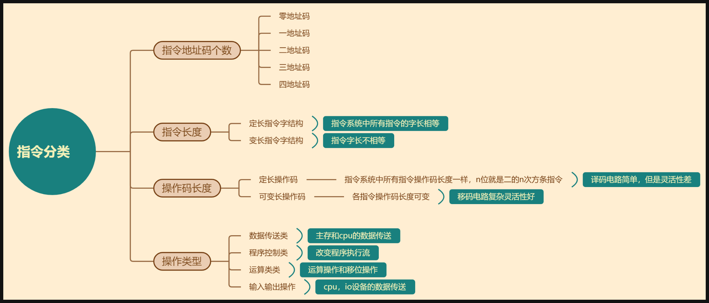

# 指令系统 · 总文件

> 说明：本章的原始笔记中，文字内容较少，大量知识点以图片形式存在（如寻址方式的具体图示、CISC 与 RISC 的对比图）。以下仅收录已提取到的文字部分。

## 一、指令格式的朴素建模

1.一条指令就是由操作码 op 和地址码 A 组成的。操作码用于告诉这条指令是干什么的，地址码决定要在哪个数据上干这个事情。由操作码可以确定地址码的数目。

2.根据每条指令的长度是否一致，分为定长指令和不定长指令。不定长的指令，有的是半字长，有的是单字长等等。

3.根据每条指令操作码的长度是否一致，也分为定长和不定长。操作码定长时，操作码的种类就和位数直接相关。

4.一个计算技巧：除了零地址指令，别的地址码条数都是用算出的值再减一，因为要留出全一这个编码，当作0个操作码的代表。

## 三、CISC 与 RISC

| 对比项目 \ 类别 | CISC | RISC |
| --- | --- | --- |
| **指令系统** | 复杂，庞大 | 简单，精简 |
| **指令数目** | 一般大于200条 | 一般小于100条 |
| **指令字长** | 不固定 | 定长 |
| **可访存指令** | 不加限制 | 只有 Load/Store 指令 |
| **各种指令执行时间** | 相差较大 | 绝大多数在一个周期内完成 |
| **各种指令使用频率** | 相差很大 | 都比较常用 |
| **通用寄存器数量** | 较少 | 多 |
| **目标代码** | 难以用优化编译生成高效的目标代码程序 | 采用优化的编译程序，生成代码较为高效 |
| **控制方式** | 绝大多数为**微程序控制** | 绝大多数为**组合逻辑控制** |
| **指令流水线** | 可以通过一定方式实现 | 必须实现 |

## 四、程序机器级代码表示

**寄存器与指令要点**
- 指令里的 IP 和 PC 意思一样，都是 program count，也就是指令指针。
- eax、ebx 是 32 位；ax、bx 是 16 位；ah、al、bh、bl 是 8 位。
- edx:eax 这种写法，指的是被除数原来是 32 位，但要扩展到 64 位，所以用两个寄存器连起来使用。
- ecx 一般用作计数器。
- loop 的计数器只能用 ecx。
- 机器级代码指的就是汇编代码。

**章节结构（原笔记提纲）**
1. 寄存器与基本概念
2. 数据传送
3. AT&T 与 Intel 两种汇编格式
4. 转移指令
5. 循环指令
6. 函数调用的机器级表达（一）
7. 函数调用的机器级表达（二）

## 十种寻址方式：

### 隐含寻址
实现本来需要两个操作数地址，但现在给一个就可以了，因为另一个直接默认保存在 ACC（累加器）等特定寄存器里。
### 立即寻址
指令里的地址码部分放的直接就是**实际的操作数本身**。比如地址码有 4 位（用补码表示），那操作数的范围就是 $-8 \sim 7$。
### 直接寻址
最基础的寻址方式，指令里给出的地址码就是一个**真实的内存地址**，CPU 直接根据这个地址去内存里找数据。
### 间接寻址
指令里的地址码太短（比如只有 3 位，只能表示 $0 \sim 7$ 的范围），放不下内存的大地址（比如 5 位）。
于是先用这 3 位地址去找内存的前 8 个单元（高位补 0 扩充），而**这前 8 个内存单元里存的，才是真正数据所在的 5 位主存地址**。通过这种“二次查找/指针”的方式，用短地址扩充了寻址范围。
### 寄存器寻址
和直接寻址非常类似，区别在于指令里的地址指的不是内存，而是**寄存器编号**。比如 3 位地址码，刚好可以指定 $2^3 = 8$ 个通用寄存器。寄存器读写极快，但造价贵、数量少。
### 寄存器间接寻址
相当于“间接寻址”的省时版。指令里的地址第一层指向某个**寄存器**，然后这个寄存器里面存的，才是数据在**内存中的真实地址**。这样只需去内存找一次数据，比普通的间接寻址少访存一次。
### 偏移寻址三兄弟（核心公式：有效地址 EA = 基础 + 偏移）
#### 1. 相对寻址
以 **PC（程序计数器）** 为基准。主要用于**转移指令**（程序跳转）。
代码执行到哪，PC 就指向哪；加上指令里的偏移量 A，就能实现向前或向后跳转。代码在内存里整体搬家也不影响相对跳转距离。
#### 2. 基址寻址
**BR（基址寄存器）固定，A 一直变**。
主要用于**多道程序运行/程序重定位**。比如某段程序被操作系统整体加载到内存的 5000 位置，程序长 200 条指令，那么 BR 被操作系统设为 5000（固定），指令里的 A 就负责表示 0~200 的相对偏移。
#### 3. 变址寻址
主要用于**循环程序和数组遍历**，**IX（变址寄存器）一直变，A 不变**。
比如遍历一个起始地址在 500 的数组，基地址 A 设定为 500 固定不变；IX 随着循环自增（如 0, 4, 8...），每次加上 A 就能精准拿到数组里各个元素的数据。

### 堆栈寻址
专门配合栈结构（LIFO 后进先出）使用，由栈顶指针 SP 隐式指明地址。
* **硬堆栈**：直接用 CPU 内部的寄存器组做栈，速度极快。
* **软堆栈**：从主存里划出一块区域当栈用。
---
### 各寻址方式“访存次数”汇总表（指令执行阶段）
> **注意**：这里的访存次数**只计算取操作数阶段**，不包含“取指令本身”的那 1 次访存。

| 寻址方式        | 有效地址计算公式 ($\text{EA}$)        | 指令执行期访存次数       | 为什么是这个次数？                     |
| ----------- | ----------------------------- | --------------- | ----------------------------- |
| **隐含寻址**    | 程序隐式指定 (如 ACC)                | **0**           | 数据在 CPU 内部寄存器里，不用找内存          |
| **立即寻址**    | $\text{A就是操作数}$               | **0**           | 取指令时操作数就已经顺便拿到了               |
| **直接寻址**    | $\text{EA} = A$               | **1**           | 去内存地址 $A$ 拿 1 次数据             |
| **一次间接寻址**  | $\text{EA} = (A)$             | **2**           | 先去内存 $A$ 拿真实地址，再去真实地址拿数据      |
| **寄存器寻址**   | $\text{EA} = R_i$             | **0**           | 数据直接在 CPU 寄存器里，不访存            |
| **寄存器间接寻址** | $\text{EA} = (R_i)$           | **1**           | 先从寄存器读出地址，去内存拿 1 次数据          |
| **相对寻址**    | $\text{EA} = (\text{PC}) + A$ | **1**           | CPU 内部算好地址后，去内存拿 1 次数据        |
| **基址寻址**    | $\text{EA} = (\text{BR}) + A$ | **1**           | CPU 内部算好地址后，去内存拿 1 次数据        |
| **变址寻址**    | $\text{EA} = (\text{IX}) + A$ | **1**           | CPU 内部算好地址后，去内存拿 1 次数据        |
| **堆栈寻址**    | SP 隐式指定                       | **硬栈 0 / 软栈 1** | 硬堆栈在 CPU 内部；软堆栈在主存，弹/压栈访存 1 次 |
## 指令种类分类

## 扩展操作码过程
###  计算题核心规律（考研高频公式）
在做“求最多能定义多少条某类指令”的题目时，掌握**状态守减/剩余推导**的规则：
若前一级操作码位数为 $m$，定义了 $K$ 条指令，则**留给下一级扩展的保留编码数**为：
$$\text{保留码数量} = 2^m - K$$
下一个级别的**最大指令数**计算公式为：
$$\text{下一级最大指令数} = (\text{上一级保留码数量}) \times 2^{\text{新增的操作码位数}}$$
#### 对应上面例子的验证：
1. **三地址**：占用 15 条，剩余 $16 - 15 = 1$ 个保留码。
2. **二地址**：扩展后共有 $1 \times 2^4 = 16$ 个编码。用掉 15 条，剩余 $16 - 15 = 1$ 个保留码。
3. **一地址**：扩展后共有 $1 \times 2^4 = 16$ 个编码。用掉 15 条，剩余 $16 - 15 = 1$ 个保留码。
4. **零地址**：扩展后共有 $1 \times 2^4 = \mathbf{16}$ 条零地址指令。
---
###  扩展操作码的两大黄金约束（做题避坑）
1. **前缀码规则（哈夫曼树思想）**：短操作码**绝对不能**是长操作码的前缀！
* 如果 `1111` 已经分配给了一条三地址加法指令，那么控制器看到 `1111` 就直接按三地址译码了，根本不可能再去读后面的 4 位来当二地址指令。
2. **操作码长度随地址数减少而增长**：
* 三地址指令 $\to$ 操作码最短（4 位）。
* 零地址指令 $\to$ 操作码最长（16 位）。