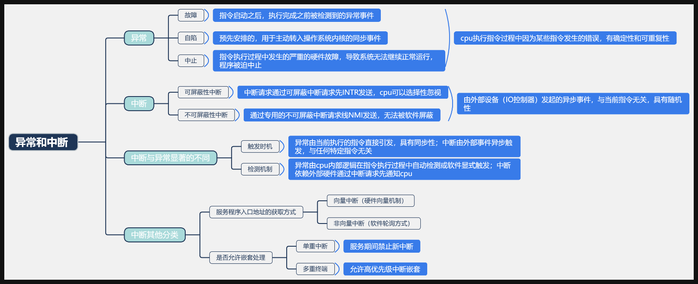

# CPU · 总文件

## 一、控制器的功能和工作原理

### 硬布线控制器

**设计要点**
1.要记住四个周期的英文描述。
2.四个周期的微操作，只有执行周期不同。这里的「微操作」指的是所执行的指令是什么，不关心具体的指令地址和数据。
3.定长的机器周期，选需要的节拍数最大者为准。
4.对于实际节拍数少于机器周期的微操作，安排在末尾。

**微操作信号的产生**
- 通过 IR、触发器、当前时钟周期的某一个节拍信号，以及来自标志位的信息，就可以推断出一个唯一确定的信号。这里的 c0 到 ck，指的就是每一个微操作、每一个指令。
- 借助电路图更好理解：在执行 M(MAR) → MDR 这个微操作时，当图中三个周期的某一个条件满足了，就会发出执行这个微操作的指令。

**电路设计步骤**
1.先确定执行周期的指令。因为取值周期、间址周期都是一样的，所以指令越多，电路越复杂。
2.确定是定长机器周期还是不定长，以及每个机器周期的节拍数。
3.把所有指令的每一个周期的微操作都写出来。
4.根据这条指令发生时的机器周期、节拍信号、状态条件，三者的某一个关系组成一个电路，然后连接到这个微操作的发生信号里。这样当特定的组合出现，这个微操作就会发生。

**微操作时序的安排**
1.先把微操作的先后顺序罗列出来。
2.最好在一个节拍内，安排一个访问主存的操作，加一个 CPU 内部操作。
3.注意，只有都在 CPU 内部进行的、有先后顺序的微操作，才可以放入同一个节拍内。
4.注意 pc+1 有很大的自由度；而有的操作虽然也是先后顺序，但因为访问了主存，就不能放在同一个节拍里。

**组合逻辑设计（建表法）**
1.先画一个表，把所有指令写在上面，然后把每一个周期的所有微操作、所有节拍写出来。
2.表中某个位置为1，说明这个指令需要当前这个机器周期下、这个节拍的这个微操作。
3.全部写完后，把某一个微操作对应的所有格子截取下来，拼接起来，就实现了这个微操作逻辑表达式的建立。

**硬布线控制器的构建流程**
1.首先把所有指令的每一个机器周期需要的微操作写出来，关键是写出执行周期的微操作。
2.确定这个 CPU 的构建结构，机器周期是否定长，每个机器周期的节拍数是多少。
3.安排微操作时序，把每一个机器周期的每一个节拍执行的微操作写出来。
4.建表，把上一步的内容写成三个表。
5.把每一个微操作从三个表中截取出来，然后把它们的节拍、机器周期、指令三者取「与」，三个机器周期之间取「或」。
6.得到的结果，就是这个微操作的逻辑电路。

**优缺点**
- 缺点：设计复杂，扩充新指令很难。
- 优点：纯电路实现，速度十分快。

### 微程序控制器

**基本思想**
本来四个周期完成一条指令，若干指令完成一个程序，继续嵌套。微程序的思想是把每个周期分为若干微指令，每一个微指令包含若干微操作（微命令），类似一种封装的思想。内部结构上，微程序控制器类似于「CPU 的 CPU」。

**下地址（微指令的跳转）**
1.下地址指的是这个微指令完成后要执行的地址。
2.不同指令不一定都要「取值后间址」，比如某条指令结束时不需要间址，那就通过标志位的信息进行跳转。
3.执行周期结束后可能进入中断周期，这时候也需要跳转。

**微程序段**
1.广义上一条指令对应一个微程序。
2.这里的微程序段，n 条机器指令就对应 n+1 个微程序段。

**编码方式**
1.加上译码器可以实现指数的扩展，但还要考虑段数。
2.因为很多指令前后是互斥的，所以每段的最大位数不是看总的微命令数。
3.好处是可以缩短指令字长。
4.坏处是需要经过译码电路才能发出微命令，所以需要的时间更长。

**地址生成方式**
1.第一种用于取值周期之间的运行过程，通过断定方式，也就是查表。
2.第二种主要用于从取值周期跳到执行周期，需要根据实际的指令动态生成地址。

**结构关系总结**
- 指令 = 微程序
- 微指令 = 某一个周期（取值周期、执行周期）
- 微命令 = 微操作
- 控制部分向执行部件发出的控制信号称为微命令，微命令执行的操作称为微操作

## 二、流水线

### 五段式指令流水线

标准阶段：IF（取指）→ ID（译码/读寄存器）→ EX（执行/算地址）→ MEM（访存）→ WB（写回）。

### 指令数据的「产生」与「使用」时刻速查表

| 指令类别 | 代表指令 | 什么时候产出数据 | 什么时候要用数据 | 考点特征 |
|---|---|---|---|---|
| 算术/逻辑运算类 | add、sub、and、or、sll 等 | EX 阶段末尾（ALU 算完立刻出来） | EX 阶段开始（ALU 输入端要用） | 产出快，有转发就完全不阻塞 |
| 访存读指令 | load、lw、ld 等 | MEM 阶段末尾（从内存读出后才出来） | EX 阶段开始（算基址偏移） | 产出慢，后面紧跟用它数据的指令必定造成 Load-Use 阻塞 1 拍 |
| 分支跳转类 | beq、bne、jmp、bgez 等 | 不向寄存器产出数据（产生新 PC） | EX/ID 阶段（比较两数大小） | 决定下一条指令去向，会引发控制冒险 |

注意：写内存指令 store、sw 是把数据写进内存，它不会向寄存器产生新结果供后续指令读，所以它不会作为「前一条指令」引发后续指令的 RAW 数据冲突。

## 数据冒险，控制冒险

**1. 数据冒险（RAW 冲突）**

情况 A：没有任何额外硬件，纯靠编译器或硬件等待
- 后果：上一条指令必须等到 WB（写回）阶段才能把数据写进寄存器，下一条指令在 ID 阶段才能读出来。
- 代价：通常需要阻塞 2 到 3 个时钟周期，也就是插入 2 到 3 个 NOP。

情况 B：采用转发（旁路 / Forwarding）技术
- 运算类到运算类：上一条在 EX 末尾产出，直接飞线给下一条的 EX 开头，阻塞 0 拍，即 0 个 NOP。
- Load 指令到运算/分支类（Load-Use 冒险）：Load 在 MEM 末尾才产出，下一条在 EX 开头就要用，时间错开 1 拍，必须阻塞 1 拍，即 1 个 NOP。

**2. 控制冒险（Branch 分支指令）**

情况 A：硬件阻塞（Stall）/ 冻结流水线
- 后果：分支指令执行完（通常在 EX 或 MEM 阶段算出是否跳转及目标地址）之前，流水线暂停取后续指令。
- 代价：产生 1 到 2 个时钟周期的气泡（Stall）。

情况 B：分支预测（Branch Prediction）
- 预测正确：流水线满载连续执行，代价为 0。
- 预测错误：必须清空（Flush）已经预取进流水线的错误指令，损失若干个时钟周期。

情况 C：延迟槽（Branch Delay Slot）
- 后果：编译器在分支指令后面紧跟安排一条无论跳不跳都必须执行的有效指令，硬件不阻塞。

### 做题通用三步判断法

1.圈出前后指令的寄存器：看后一条指令用的源寄存器（Source），是不是前一条指令的目的寄存器（Destination）。
2.看前一条指令是不是 Load：如果前一条是 add、sub 等运算指令且有转发，则无阻塞；如果前一条是 load 且后一条紧接着用这个寄存器，则必定阻塞 1 拍。
3.看有没有分支指令（beq、bne）：如果题目说「硬件阻塞处理控制冒险」，则分支指令后的下一条指令必定阻塞。

## CPI 的定义与四类 CPU 对比

CPI（Cycles Per Instruction）= 执行程序所需的总时钟周期数 ÷ 执行的指令条数。

**四类 CPU 典型 CPI 速记表**

| 处理器类型 | 时钟周期长度 | 执行一条指令耗费周期 | 稳定流出速率 | 理想 CPI |
|---|---|---|---|---|
| 单周期 CPU | 极长（取最慢指令耗时） | 1 个周期 | 1 拍 1 条 | = 1 |
| 多周期 CPU | 较短（取单步功能部件耗时） | 多个周期（3~5拍） | 多拍 1 条 | > 1 |
| 基本流水线 CPU | 短（瓶颈段耗时 + 寄存器延时） | 5 个周期（分步流动） | 1 拍 1 条 | = 1 |
| 超标量流水线 CPU | 短 | 5 个周期（多条并发） | 1 拍 m 条 | < 1 |

**原理说明**
- 单周期 CPU（CPI = 1）：一条指令的所有执行阶段被硬塞在一个极其漫长的时钟周期内一次性串行跑完。每过 1 个时钟周期必定流出 1 条完整指令，所以任何情况下 CPI = 1。
- 多周期 CPU（CPI > 1）：一条指令的不同执行步骤拆分到不同的时钟周期。例如简单指令用 3 拍，复杂指令（如访存指令）用 5 拍，所以 CPI > 1。
- 基本流水线 CPU（理想情况 CPI = 1）：虽然一条指令走完 5 段流水线需要 5 拍，但在流水线充满且理想无阻塞的稳定状态下，每个时钟周期流出 1 条指令。连续执行 n 条指令总耗时为 (k + n - 1) 拍，当 n 趋于无穷时，CPI 趋于 1。
- 超标量流水线 CPU（理想情况 CPI < 1）：内部有多条并行的流水线（度 m > 1），每个时钟周期可以同时发射并完成多条指令。理想满载状态下平均每条指令仅花费 1/m 拍，即 CPI = 1/m < 1，例如度为 4 时 CPI = 0.25，其 IPC = 4。

所以，理想情况下 CPI 为 1 的只有单周期 CPU 和基本流水线 CPU。

## 超标量、超长指令字、超流水线对比

**核心对比速查表**

| 技术名称 | 核心实现机制 | 调度方式 | 硬件复杂度 | 对编译器的依赖 | 理想 CPI |
|---|---|---|---|---|---|
| 超标量 | 空间并行：配备多套译码、发射与执行部件，单周期发射多条独立指令 | 硬件动态调度 | 极高 | 较低 | < 1 |
| 超长指令字 VLIW | 软硬协同：将多个独立微操作打包成一条超长指令，单周期发射执行 | 软件静态调度 | 中等/较低 | 极高 | < 1 |
| 超流水线 | 时间切分：将常规流水段进一步细分成更多子阶段，大幅拉高主频 | 时钟驱动 | 较高 | 中等 | = 1（但时钟频率极高） |

**超标量技术（Superscalar）**
- 原理：在 CPU 内部放置多个相同或不同类型的执行部件（如 2 个 ALU + 1 个 FPU + 1 个访存部件），每个时钟周期同时取指、译码并并行发射 m 条指令（度 m > 1）。
- 优点：对旧软件和传统指令集完全向前兼容，程序无需重新编译就能提速。
- 代价：硬件检测相关性（RAW/WAR/WAW）极其复杂，晶体管开销和功耗大。
- 代表架构：现代绝大多数 x86（Intel Core、AMD Ryzen）、ARM Cortex 处理器。

**超长指令字技术（VLIW）**
- 原理：放弃复杂的硬件动态调度，把挖掘并行的重任全部交给优化编译器。编译器把 3 到 8 个互不相关的操作拼接成一条极长的指令字（通常 64 到 256 位以上），由硬件直接送给对应的多个执行部件并发执行。
- 优点：硬件结构精简，省去了复杂的动态调度和冲突检测电路，面积小、能效比高。
- 代价：如果编译器找不到足够的并行操作，必须在超长指令里填充大量空操作（NOP），导致代码体积膨胀；二进制代码与硬件执行部件深度绑定，不具备跨代兼容性。
- 代表架构：DSP 芯片（如 TI C6000）、早期的 Intel Itanium（IA-64）、现代许多 GPU/NPU 的底层 VLIW 单元。

**超流水线技术（Superpipelining）**
- 原理：不增加额外的执行部件，而是把原有的流水线阶段切得更细（例如把 5 级流水细分成 15 到 20 级）。因为每级逻辑延迟变短，CPU 时钟频率可以大幅提升。
- 优点：可以在不大幅增加执行逻辑部件的前提下，大幅拉高 CPU 主频。
- 代价：流水线级数过深，一旦遇到分支预测失败或数据冒险导致清空、阻塞，流水线排空惩罚极大。
- 代表架构：Intel Pentium 4（NetBurst 架构，多达 20 到 31 级流水线）。

**口诀**
- 超标量：硬件挑大梁，多路并行同时发。
- 超长指令字：编译挑大梁，打包长条一起发。
- 超流水线：段数切更细，极高主频快步跑。

三者都是为了挖掘指令级并行（ILP）而发展出的经典 CPU 架构技术，核心区别在于「靠硬件动态调度」还是「靠软件静态编译」，以及「从空间并行入手」还是「从时间切分入手」。

## 流水线补充要点

1.流水线寄存器是硬件不动的，是指令在移动，才造成了流水线的局面。
2.在有转发（旁路）技术的前提下：运算类到运算类需要插入 0 条空操作；读内存类到运算类（Load-Use）必定需要插入 1 条空操作。
3.CPU = 数据通路（Datapath）+ 控制部件（Control Unit）。
4.对于常规单流水线（度为1），执行 n 条指令的时间为 T = [ k + (n - 1) ] × Δt，其中 k 为流水段数，Δt 为每个流水段耗时。
5.当采用度为 m 的超标量流水线时，每个时钟周期同时发射并执行 m 条指令，相当于把 n 条指令分成「n 除以 m 向上取整」组，T = [ k + (「n/m 向上取整」 - 1) ] × Δt。

## 三、CPU 异常和中断

### 分类思维导图

### 补充要点

1.故障在可恢复的情况下（如缺页）会重新执行当前指令；在不可恢复的情况下（如非法指令、除零）会中止当前进程。
2.自陷一般都是执行它的下一条指令。
3.故障和自陷属于软件中断；中止和外中断属于硬件中断。
4.异常是内中断，中断是外中断。

## 数据冒险做题思路：
这种题理解起来其实非常简单，核心就一句话：
> **前一条指令“写”的寄存器，恰好是后一条指令需要“读”的寄存器**，就发生了写后读 RAW 数据冒险。
也就是：前脚刚写，后脚就要读。
---
### 第一步：分析每条指令“读”和“写”了哪个寄存器
在 MIPS/RISC-V 这类指令集中：
- `add dst, src1, src2`：写 `dst`，读 `src1` 和 `src2`
- `load dst, offset(base)`：写 `dst`，读 `base`
- `store src, offset(base)`：写内存，读 `src` 和 `base`
题目指令：
1. **I1**: `add s2, s1, s0`
- 写：`s2`
- 读：`s1`, `s0`
2. **I2**: `load s3, 0(t2)`
- 写：`s3`
- 读：`t2`
3. **I3**: `add s2, s2, s3`
- 写：`s2`
- 读：`s2`, `s3`
4. **I4**: `store s2, 0(t2)`
- 写：无，写的是内存
- 读：`s2`, `t2`
---
### 第二步：逐个选项排查
#### 选项 A：I1 和 I3
- I1 写了 `s2`
- I3 需要读 `s2`
所以存在数据冒险。
#### 选项 B：I2 和 I3
- I2 写了 `s3`
- I3 需要读 `s3`
所以存在数据冒险。
#### 选项 C：I2 和 I4
- I2 写了 `s3`
- I4 需要读的是 `s2` 和 `t2`
I2 改变的是 `s3`，而 I4 根本不关心 `s3`，两者互不干涉。
所以 **不存在数据冒险**。
#### 选项 D：I3 和 I4
- I3 写了 `s2`
- I4 需要读 `s2`
所以存在数据冒险。
---
### 总结秒杀技巧
直接拿前一条指令“写入”的寄存器，对比后一条指令“读取”的寄存器：
- I1 → I3：`s2` 撞车，存在数据冒险
- I2 → I3：`s3` 撞车，存在数据冒险
- I3 → I4：`s2` 撞车，存在数据冒险
- I2 → I4：I2 写 `s3`，I4 读 `s2` 和 `t2`，没有撞车，不存在数据冒险
所以答案选 **C**。

## CPU四大组成部分
### 一、 执行部件（数据通路 / Datapath 核心）
* **算术逻辑单元（ALU）**：负责二进制算术运算与逻辑运算。
* **标志寄存器（FR / PSW）**：保存条件码（如 $ZF$、$CF$、$OF$、$SF$ 等），**对程序员可见**。
* **暂存寄存器（补充）**：用于暂存从主存读出的数据或 ALU 运算的中间结果，防止数据在总线上发生冲突。**对程序员不可见**。
---
### 二、 寄存器部件（按程序员可见性精准划分）
这是考研高频考点，直接按“可见 / 不可见”分类记忆效率最高：
#### 1. 对程序员可见的寄存器（可在汇编语言中显式操作）
* **程序计数器（PC）**：存放下一条要执行指令的内存地址（注意：在某些架构如 ARM 中可直接读取/写入）。
* **通用寄存器组（GPRs）**：如 AX、BX、CX、DX、$s0 \sim s7$、$t0 \sim t7$ 等，用于存放操作数或地址。
* **标志寄存器 / 程序状态字寄存器（FR / PSW）**：记录当前 CPU 的运行状态与标志位。
* **基址寄存器 / 变址寄存器**：用于复杂寻址模式（如 $BR$、$IX$）。
* **栈指针寄存器（SP）**：指示当前系统栈顶地址。
#### 2. 对程序员不可见的寄存器（仅由硬件/内核直接控制）
* **指令寄存器（IR）**：保存当前正在执行的指令。
* **存储器地址寄存器（MAR）**：保存当前 CPU 正在访问的内存/总线地址。
* **存储器数据寄存器（MDR）**：保存当前 CPU 从内存读出或准备写入内存的数据。
* **控制寄存器（如页表基址寄存器 CR3 / PTBR）**：存放页表起始地址，用于 MMU 虚拟地址转换。
* **微指令寄存器（uIR / 补充）**：若采用微程序控制器，用于存放当前正在执行的微指令。
---
### 三、 控制部件（CU / Control Unit）
控制部件是 CPU 的“大脑”，负责解析指令并发出微操作控制信号：
* **指令译码器（ID）**：对 IR 中的操作码进行译码，确定指令类型。
* **时序系统**：产生节拍脉冲（Clock），确保各部件按时间顺序协调工作。
* **微操作信号发生器**：根据译码结果和时序信号，产生控制全局的微操作信号（硬布线/组合逻辑，或微程序控制）。
* **总线控制逻辑**：管理内部总线和外部总线的数据握手与裁决。
* **程序状态/中断逻辑（补充）**：负责响应中断请求、进行异常处理及优先级裁决。
---
### 四、 补充：存储管理部件（MMU）
在现代 CPU 中，往往还包含 **内存管理单元（MMU, Memory Management Unit）**：
* 包含 **TLB（快表）** 和 **页表基址寄存器（PTBR）**。
* **作用**：负责将程序给出的逻辑地址（虚拟地址）快速转换为物理内存地址，并进行内存访问权限检查。
---
### 💡 秒杀记忆总结
1. **CPU 主体四大件**：**ALU**（算）、**寄存器**（存）、**CU**（控）、**中断/总线逻辑**（协调）。
2. **不可见“四大金刚”**：**IR、MAR、MDR、暂存/控制寄存器（如 CR3）**。凡是汇编指令里写不出来的，一律按不可见处理！
## 单周期，多周期，流水线周期计算

### 一、 方案 2：多指令周期（串行执行，可变步数）
在多指令周期方案中，**时钟周期（频率）是固定的**，但**不同指令占用的时钟周期数（CPI，Cycles Per Instruction）不同**。
1. **计算公式**：
* **单条指令执行时间** = 该指令包含的步骤数（CPI） $\times$ 时钟周期（$\tau$）。
* **执行 $n$ 条指令的总时间**：
$$\text{总时间} = \sum_{i=1}^{n} (\text{CPI}_i \times \tau) = (\text{CPI}_1 + \text{CPI}_2 + \dots + \text{CPI}_n) \times \tau$$
* **平均指令周期（Average Instruction Cycle）**：
$$\text{平均指令周期} = \overline{\text{CPI}} \times \tau$$
2. **直观理解**：
* 简单指令（如加法 `ADD`）：只需要 3 个时钟周期。
* 复杂指令（如访存 `LOAD`）：需要 5 个时钟周期。
* **串行执行**：做完第 1 条指令（耗时 3 个周期），再做第 2 条指令（耗时 5 个周期），2 条指令总耗时就是 $3 + 5 = 8$ 个时钟周期。
---
### 二、 方案 3：流水线方案（重叠并行执行）
在流水线方案中，硬件被切分为 $k$ 个独立的流水段（如取指 IF、译码 ID、执行 EX、访存 MEM、写回 WB）。
1. **流水线时钟周期（$\tau$）的确定**：
流水线时钟周期取决于**耗时最长的那一个流水段**（加上段间锁存器延迟）：
$$\tau = \max(\text{段}_1, \text{段}_2, \dots, \text{段}_k) + \text{锁存器延迟}$$
2. **单条指令执行时间**：
一条指令从进入到完全走出流水线，经过 $k$ 个流水段，总耗时为 $k \times \tau$。
3. **执行 $n$ 条指令的总时间（考研重点公式）**：
* **理想状态下（无冲突）**：
* 第 1 条指令走出流水线需要 $k$ 个时钟周期。
* 之后**每一个时钟周期就会产生/走出一条指令**。
* 剩下的 $(n - 1)$ 条指令需要 $(n - 1)$ 个时钟周期。
$$\text{总时间} = (k + n - 1) \times \tau$$
---
### 三、 三种方案对比速查表
假设 CPU 有 5 个步骤，步骤耗时分别为 2ns, 2ns, 3ns, 2ns, 2ns。

| 方案 | 系统的时钟周期 $\tau$ | 单条指令执行时间 | 执行 $n$ 条指令的总时间 |
| --- | --- | --- | --- |
| **1. 单指令周期** | $\tau = 2+2+3+2+2 = 11\text{ns}$ | $1 \times 11 = 11\text{ns}$ | $n \times 11\text{ns}$ |
| **2. 多指令周期** | $\tau = \text{定长基本节拍（如 2ns 或 3ns）}$ | 根据指令不同，如 $3 \times \tau$ 或 $5 \times \tau$ | $\left(\sum \text{CPI}_i\right) \times \tau$ |
| **3. 流水线方案** | $\tau = \max(\text{各段}) = 3\text{ns}$ | $5 \times 3 = 15\text{ns}$（单条变慢了） | **$(5 + n - 1) \times 3\text{ns}$**（吞吐量极高） |
## 指令周期，机器周期，时钟周期
为你按照“从微观到宏观”的逆向顺序，梳理 CPU 中的时间概念与大小关系：
### 一、 逆向概念推导（从微观硬件到宏观指令）
1. **时钟周期 / 节拍 / T周期（微观基石）**
- **定义**：CPU 主频的倒数（如 3GHz $\to \frac{1}{3\text{GHz}} \approx 0.33\text{ns}$），是 **CPU 内部最基础、不可再分的最小时间单位**。
- **硬件映射**：执行 **1 条微指令** 的时间。

1. **机器周期 / CPU周期（基本动作）**
- **定义**：CPU 完成一个**基本独立操作**（如：去内存存取一次数据、去内存取一条指令）所需的时间。
- **构成**：由 **若干个时钟周期（节拍）** 拼接组成。
​
1. **指令周期（宏观业务）**
- **定义**：CPU **从主存取出并完整执行完一条机器指令** 的总时间。
- **构成**：由 **若干个机器周期**（如取指周期、间址周期、执行周期、中断周期）拼接组成。
​
### 二、 时间大小关系（从短到长）
$$\text{时钟周期 } (T) = \text{微指令周期} < \text{机器周期} \le \text{指令周期}$$
> **核心细节**：
> - **单指令周期 CPU**：所有指令的指令周期都**等于最长指令的执行时间**，且等于固定数量的机器周期。
> - **多指令周期 CPU**：简单指令的指令周期短（机器周期少），复杂指令的指令周期长（机器周期多）。
> - **流水线 CPU**：流水线时钟周期 $\tau$ 取决于**耗时最长的那个流水段**的时间。